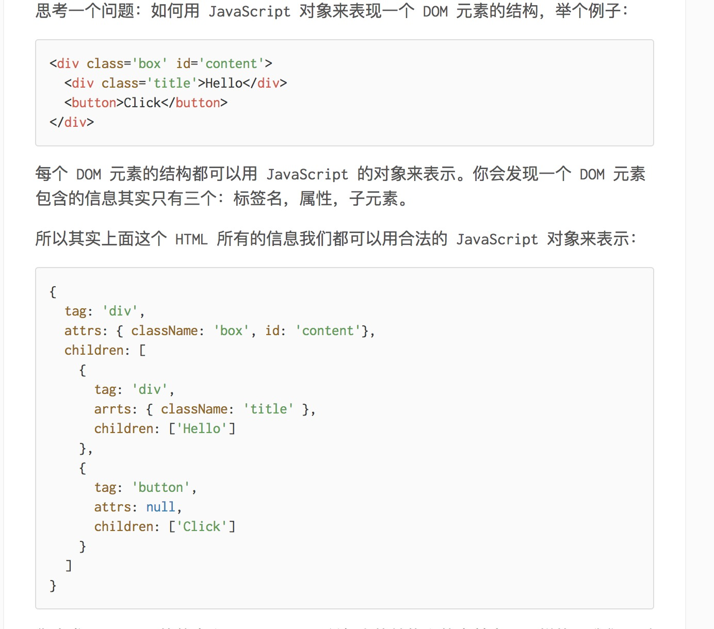
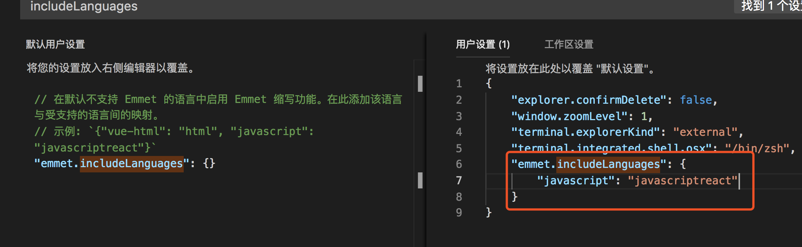

# react_demo
react_demo
# 基本环境安装
1. 安装脚手架

	``` 
	npm install -g create-react-app
	```
2. 初始化项目

	``` 
	create-react-app <project-direcory>
	```
3. 运行

	```
	npm start
	```
	
# 简记
1. jsx原理
	> 源自《react小书》


2. vscode： jsx-html快速补全插件设置



3. 现在只要记住一点就可以了：这些 on* 的事件监听只能用在普通的 HTML 的标签上，而不能用在组件标签上。
4. 注意，当我们要改变组件的状态的时候，不能直接用 this.state = xxx 这种方式来修改，如果这样做 React.js 就没办法知道你修改了组件的状态，它也就没有办法更新页面。所以，一定要使用 React.js 提供的 setState 方法，它接受一个对象或者函数作为参数。
5. 事件传参

``` 
handleSetState(key,event) {
	this.setState({
	  [key]: event.target.value
	})
}
// 第一种方式：
<input 
  value={this.state.username}
  onChange={this.handleSetState.bind(this, 'username')}
/>
// 第二种方式：
<input 
  value={this.state.username}
  onChange={(e)=>{this.handleSetState('username', e)}}
/>

```

6. 数组类型的state值更新

``` 
// 第一种方法 (不推荐)
this.state.userList.push(item)
this.setState({
	userList: this.state.userList
})
    
// 第二种方法
this.setState({
	userList: [...this.state.userList,item]
})

// 第三种方法
this.setState((state)=> {
  state.userList.splice(0,0,item)
  return {userList: state.userList}
},()=> {
  console.log('this.state.userList=======>',this.state.userList); 
})

// 第四种方法
this.state.userList.splice(0,0,item)
this.setState({
  userList: this.state.userList
},()=> {
  console.log('this.state.userList=======>',this.state.userList);
})
```

7. 如何使用state变化之后的值

> 通过点击事件之后就使用修改之后的state的值，但是会发state中的并没有被立即修改，还是原先的值，我们都知道那是因为setState就相当于是一个异步操作，不能立即被修改

``` 
state = {
	isClick: false
}
this.setState({
	isClick: true
})
console.log(this.state.isClick) // false

// 方法一：
this.setState({
	isClick: true
}, ()=> {
	console.log(this.state.isClick) // true
})

// 方法二
async handleClick() {
	await this.setState({
		isClick: true
	})
	console.log(this.state.isClick) // true
}
```
